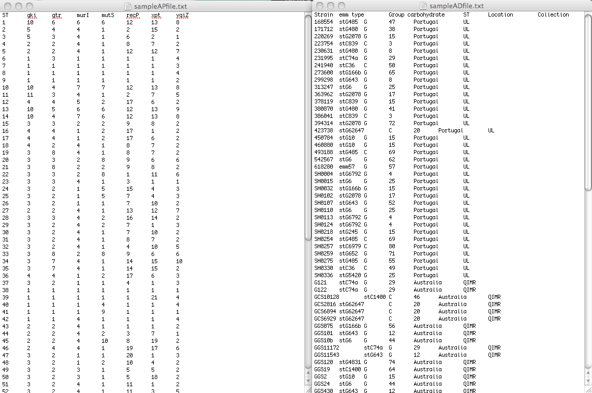
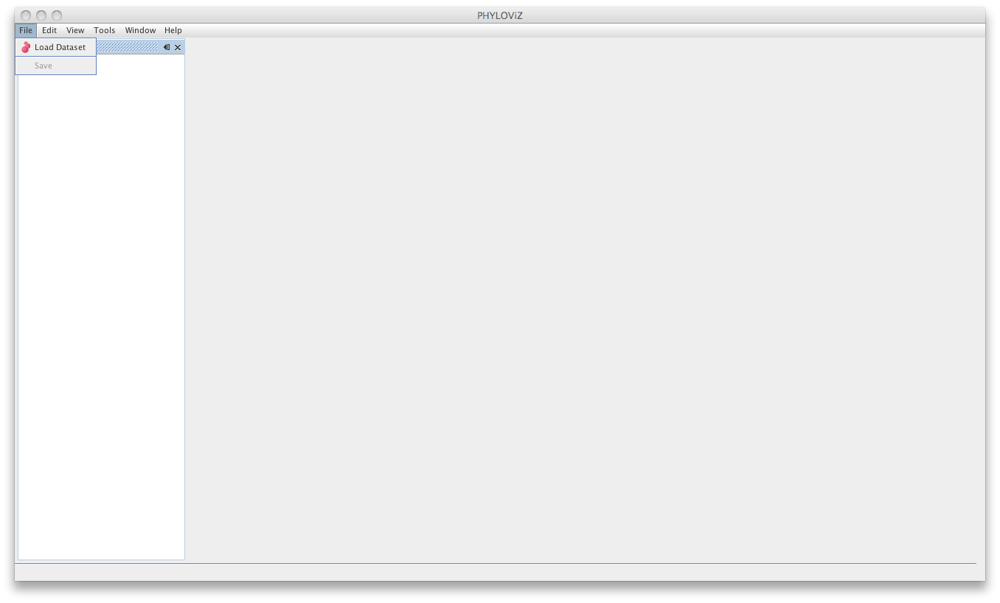
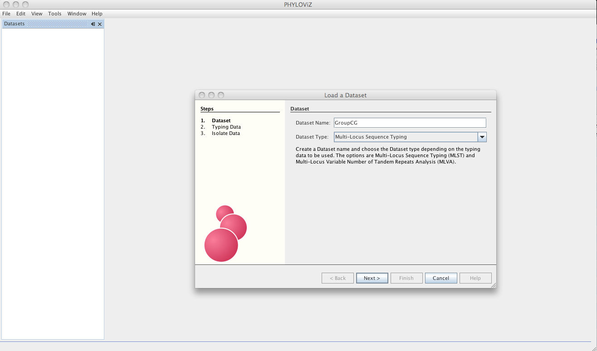
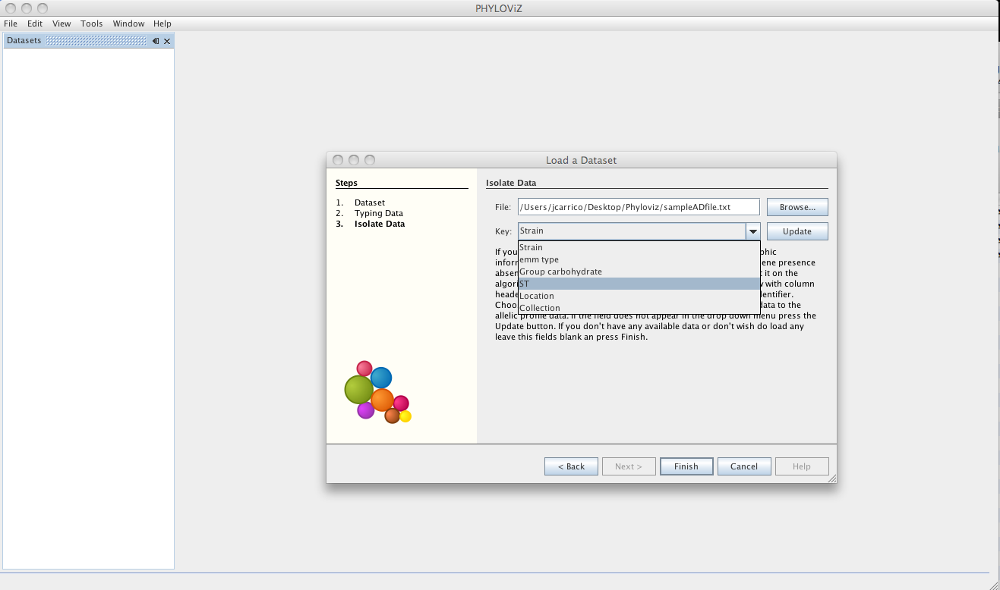
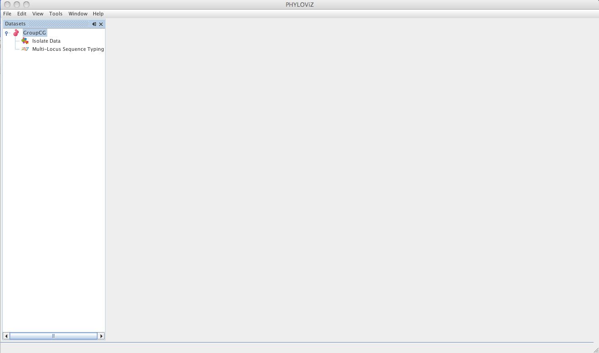
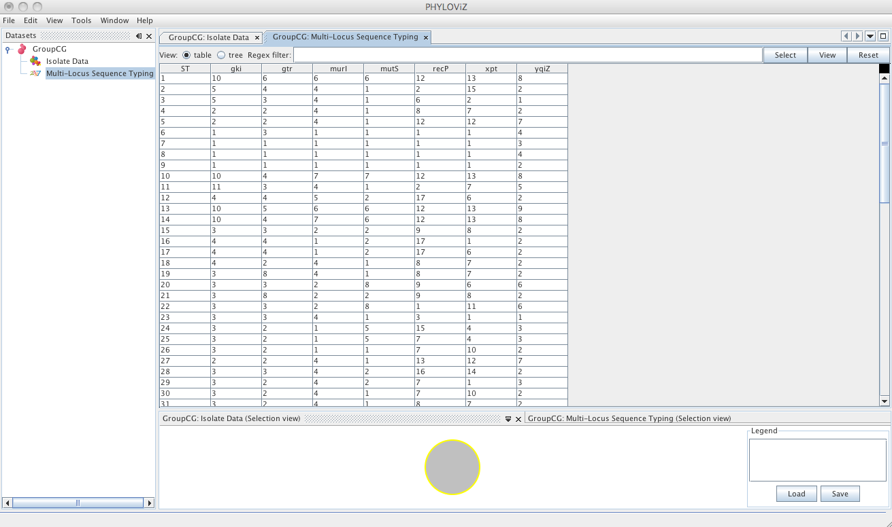
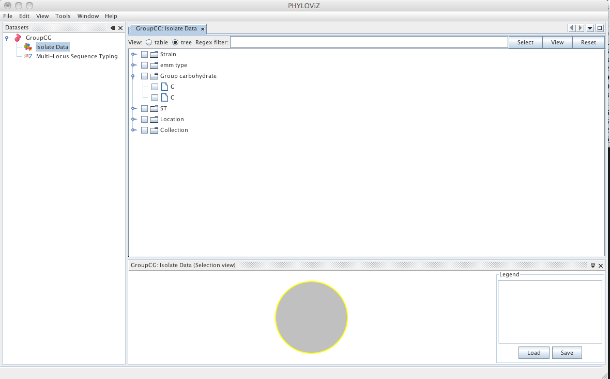

# Loading data

## File formats

To be able to analize and visualize your data, PHYLOViZ needs two separate files: One file contains the allelic profile data of the method you are using (Typing Data), while the other will contain accessory data (Isolate Data).

The Typing data should be a tab separated file containing the allelic profiles, formatted as follows: the first line should contain the column headers (usually markers or MLST locus identifiers). The first column should be the allelic profile identifier (Sequence Type number). The following columns are the loci used in the analysis.

If the Isolate data file is not used, the Typing data file should also represent the number of repeated profiles in a collection, that is to say that if a given profile appears in a collection n times it should be repeated in the Typing data file n times. In case of an Isolate data file is used the frequency of each type will be represented by the number of entries with a given Sequence type, in the Isolate file only and the frequency represented by repeated profiles in the Typing data file will not be used

You can find an example of MLST data correctly formatted [here](_images/sampleAPfile.txt). Note that in this file several STs are represented by more than one isolate (e.g. ST3 was found in 6 isolates).

The Isolate data file can contain epidemiological and/or demographic data or any other data you want to visualize overlaid onto the results of the analysis algorithms. The link between the data in the two files is made by the Sequence Type identifier. You can find an example file correctly formatted [here](_images/sampleADfile.txt).

## Loading a Dataset

Go to _File_ menu and choose _Load Dataset_.

If any errors in the data loading process are found they will be displayed in the session _Tab_. In the following screenshot you can see an example where allelic profiles were repeated with different identifiers. In the example data,we created ST81 as copy of ST1 profile and PHYLOViZ detects it and eliminates it from the analysis.

The dialog will now guide the user in the loading of the data. The first step is choosing a name for your Dataset since now PHYLOViZ supports multiple datasets open simultaneously. You must also choose the Dataset Type from the dropbox menu.

The Dataset type can be MLST or MLVA datasets with any number of loci, without any missing data. Lines with missing data will be excluded on load. If you have installed the Single Nucleotide Polymorphism (SNP) plugin, you can also access it on the Dataset type. See the [Sample Datasets](http://www.phyloviz.net/wiki/sampledatasets/) page to access some test data for the sequence-based typing methods available.

The next step is loading the allelic profile data for the method you selected.

After loading the allelic profile data, you can choose a file with information on your isolates for which the allelic profile was loaded. The linking field, as explained before, should be the Sequence Identifier and should be selected in the Key dropdown menu.

Then the dataset is loaded and double clicking on the dataset name opens the available data.

Double clicking on Isolate Data and Typing Data in the tree menu under the dataset name opens the respective tabs.

The default view is the _table_ view. Also available is the tree view, where it is easier to visualize what information is available in the different fields and to select combinations of fields with specific values.

